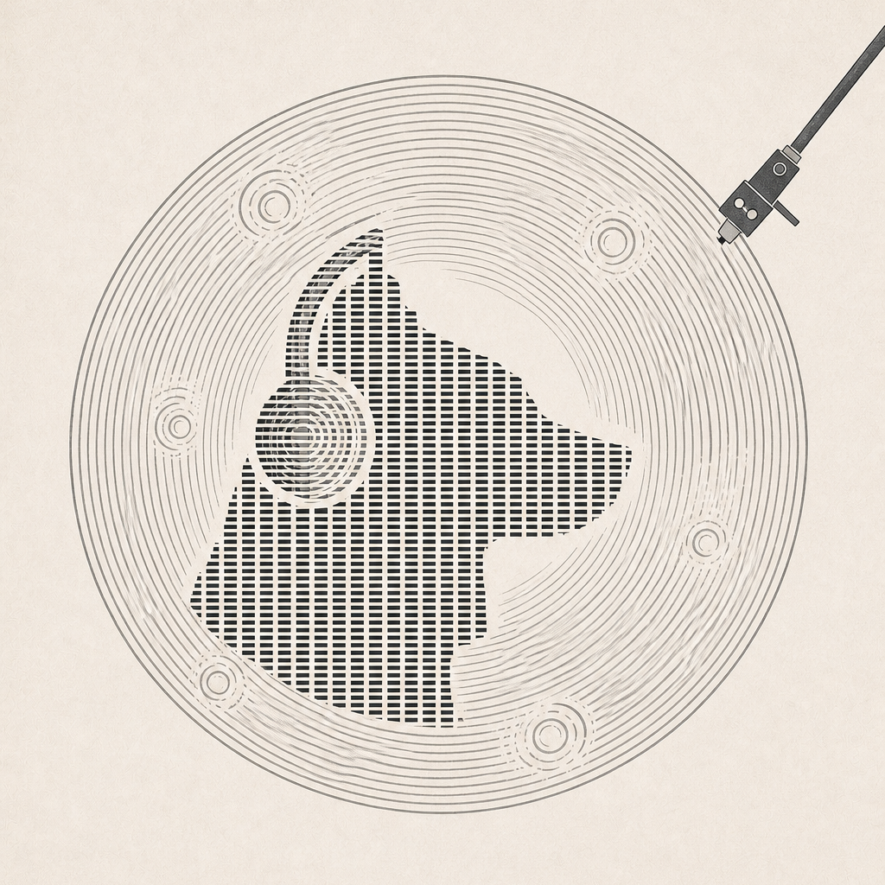
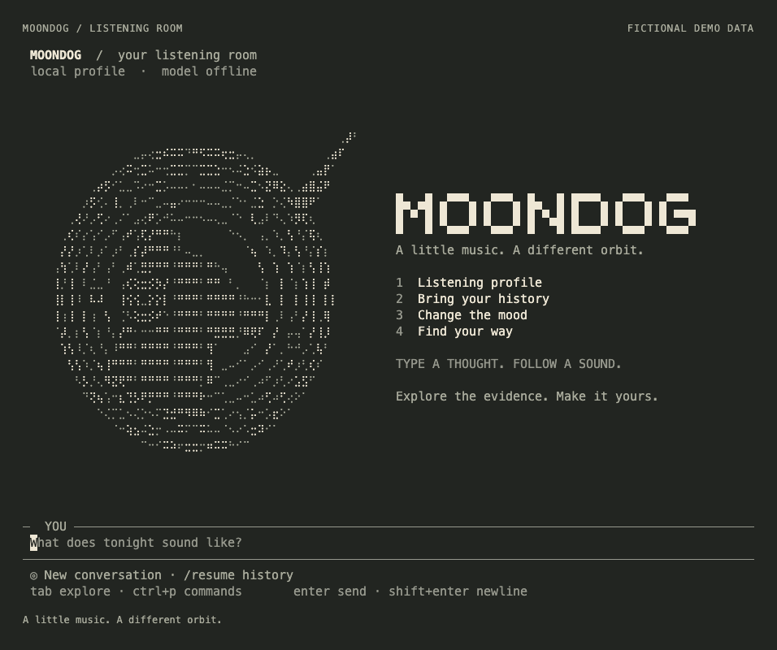
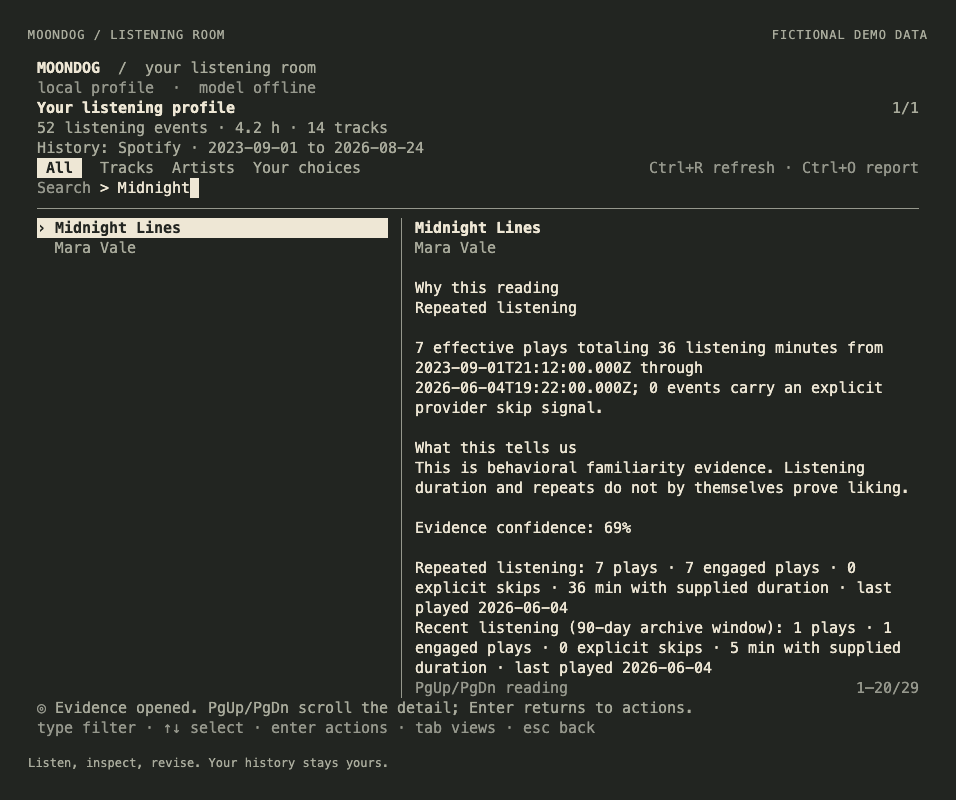

<p align="center">
  
</p>

<h1 align="center">Moondog</h1>

<p align="center"><strong>A personal music agent that can show its work.</strong></p>

<p align="center">Your listening history. Your corrections. A new way through the music.</p>

<p align="center">
  
</p>

<p align="center"><sub>The real terminal interface, shown with fictional local listening data.</sub></p>

Moondog turns your listening history into a profile you can inspect and correct.
Explore the evidence, shape a playlist with an agent, and keep the distinction between what you played and what you like.

Built around [Pi](https://github.com/earendil-works/pi), with local profile storage and a keyboard-first listening room.

## Start listening

Requires Node.js **22.19.0 or newer** on macOS or Linux.

```bash
git clone https://github.com/Audiofool934/moondog.git
cd moondog
npm ci
npm start
```

Profile review and corrections work locally without a model, API key, or music-service login.
To try the grounded agent loop with fictional data and no credentials, run `npm run demo`.

## Bring your history. Correct the reading.

Import a saved Spotify Account Data or Extended Streaming History ZIP from inside Moondog:

```text
/import "/path/to/spotify-history.zip"
```

The import opens your listening profile immediately, with the receipt and full report kept in the conversation.
Repeated imports are deduplicated, and the original archive stays unchanged.
Saved ListenBrainz history and Apple Music library XML are also supported through the [terminal guide](docs/TERMINAL_GUIDE.md#import-and-inspect-listening-history).

| In your profile | What you can do |
| --- | --- |
| **Find a reading** | Filter tracks and artists, then inspect the selected item. |
| **See why** | Read the observed listening, evidence limits, and your explicit choices separately. |
| **Make a choice** | Mark a track or artist Like or Avoid and see the profile update. |
| **Change your mind** | Retract a choice while preserving the original listening history. |

<p align="center">
  
</p>

<p align="center"><sub>Actual profile view with fictional data. Listening time establishes familiarity; it does not establish liking.</sub></p>

The full Tasteprint adds a chronological Listening Time Machine, listening patterns, and bounded rediscovery candidates.
Open it with `/taste report`, or export a private self-contained HTML report from the CLI.

## Stay in the listening room

| Command or key | Action |
| --- | --- |
| `/taste` | Open your interactive listening profile. |
| Type, ↑ ↓, Enter | Filter, select, and inspect evidence or make a choice. |
| Tab in the profile | Switch between All, Tracks, Artists, and Your choices. |
| Esc | Return with your conversation draft preserved. |
| Ctrl+P | Search commands. |
| `/resume` · `/new` | Continue a saved conversation or start another. |
| `/home` | Revisit the listening room without clearing the conversation. |

Every launch starts a fresh conversation; your profile and durable memories carry across sessions.
The home screen uses animated character art and adapts to the terminal size.
Choose `/theme paper` or `/theme charcoal`, switch to `/art ascii`, or turn animation off with `/motion off`.

## Add an agent when you want one

Use `/auth` and `/model` to enable conversation through Pi.
Ask for a path through your listening history, revise the proposed order, or look beyond your library.
Moondog validates selected tracks against tool-provided candidates and keeps public catalog evidence separate from personal listening evidence.

| Optional connection | What it adds |
| --- | --- |
| **A Pi model** | Conversation, grounded discovery, and playlist collaboration. |
| **Codex CLI** | `/web` research with source links, using an installed and signed-in Codex CLI. |
| **Spotify OAuth** | Playback control and explicit, guarded private-playlist actions. |

Local profile review makes no network request.
Agent conversation and connected features use their configured remote services; `/web` sends the requested public query or URL without automatically attaching your profile, history, or local files.
Spotify archive import is independent of Spotify OAuth.
Read the [connection and data details](docs/TERMINAL_GUIDE.md) before setting up an integration.

## Explore further

- [Terminal guide](docs/TERMINAL_GUIDE.md): import formats, commands, appearance, models, Spotify, memory, and local data controls.
- [Private Tasteprint](docs/PRIVATE_TASTEPRINT.md): what the evidence supports and what a report reveals.
- [Product charter](docs/PRODUCT_CHARTER.md) and [public roadmap](docs/ROADMAP.md): direction and current boundaries.
- [Runtime architecture](docs/ADR_0001_AGENT_RUNTIME_AND_CLI.md) and [data contracts](contracts/README.md): how the parts fit together.
- [Contribution guide](CONTRIBUTING.md) and [release readiness](docs/PUBLIC_RELEASE_READINESS.md): local setup, verification, and private-data boundaries.

Moondog is in early development, with the Pi-based TUI as its current product surface.
GUI and Studio development is paused; existing [browser prototypes](docs/TERMINAL_GUIDE.md#archived-gui-prototypes-paused) remain available for reference.
A public license has not yet been selected.

<p align="center"><sub>Built by RUC AI Music Lab under the 求索育研 program.</sub></p>
