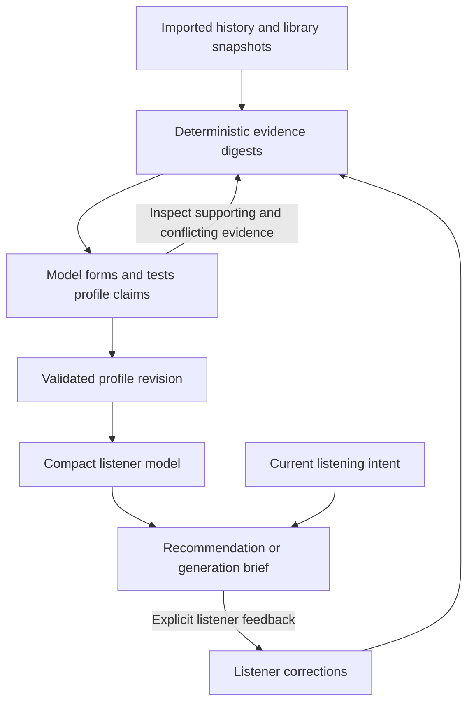

# Listener profile construction from large music archives

Research date: 2026-10-03.
Status: research findings, a refined profiling skill, and a proposed next implementation slice.

Moondog should combine a complete local evidence store, deterministic analysis, model-led investigation, and a compact, revisable listener model.
The important next capability is a profile builder that preserves its evidence and can resume or update across sessions.
Access to every record is necessary, but it does not by itself establish that a model has built a complete or useful profile.

## What the other harnesses contribute

### Hermes separates procedure, persistent facts, and recall

Hermes keeps a small curated user profile and general memory, while prior conversations remain separately searchable.
Its skill system exposes descriptions first, loads procedures when relevant, and opens supporting reference files on demand.
For large source collections, its documented learning workflow builds a compact entry point plus topic references.
These are distinct mechanisms for persistent knowledge and reusable procedure.
Sources: [persistent memory](https://hermes-agent.nousresearch.com/docs/user-guide/features/memory/) and [skills](https://hermes-agent.nousresearch.com/docs/user-guide/features/skills#large-sources-become-knowledge-base-skills).

The session-search implementation provides discovery, reading, and scrolling over stored messages without a summarization model call.
Its read mode limits message count and message size and marks truncation, so the memory documentation's broad claim of no truncation should not be treated as an API guarantee.
Source: [session search at the inspected commit](https://github.com/NousResearch/hermes-agent/blob/db45b44ab72af81974adfb01c9ecd6967f5bec29/tools/session_search_tool.py#L447).

**Moondog implication:** the profiling skill should describe how to investigate taste.
The listener's records and derived profile should stay in Moondog's domain stores.
Keep the normal context small and make supporting evidence reachable through tools with explicit totals and continuation pointers.
A reusable skill must not become a private listener-data dump.

### OpenClaw separates observations from durable conclusions

OpenClaw's memory architecture distinguishes a compact curated layer from larger episodic records and human-facing review output.
It tracks provenance, observation time, and supersession separately from the prose.
It also prevents recalled material from being learned again as fresh evidence.
Source: [memory architecture](https://docs.openclaw.ai/concepts/memory-architecture).

Its documented dreaming workflow stages observations, develops candidate interpretations, and then consolidates eligible candidates.
The final writer validates source references and preserves a recoverable prior version.
Its user model gives changed preferences an explicit active or superseded state.
Sources: [dreaming](https://docs.openclaw.ai/concepts/dreaming) and [user model](https://docs.openclaw.ai/concepts/user-model#supersede-in-place).

**Moondog implication:** separate measured listening patterns, inferred taste, and explicit listener assertions.
Preserve the evidence behind each conclusion, including contradictions.
Apply corrections to the current reading without rewriting listening history.
Copy the separation of stages; choose scheduling only when the actual listening workflow warrants it.
OpenClaw's conversational recall-frequency promotion thresholds are not music-preference weights.
Asking about an artist repeatedly must not make that artist a stronger musical preference automatically.

### Honcho provides a useful model for task-specific personalization

Hermes' optional Honcho integration combines a persistent user representation with reasoning about what is relevant to the current conversation.
Its documented deeper reasoning can audit gaps and reconcile conflicting conclusions.
This is an optional backend with its own storage and model calls, rather than a property of Hermes' basic memory files.
Source: [Hermes Honcho integration](https://hermes-agent.nousresearch.com/docs/user-guide/features/honcho#architecture).

**Moondog implication:** separate enduring musical interests from the current intent.
A request for quiet working music should select relevant parts of the profile without becoming a permanent preference.
Borrow the reasoning pattern first and assess an external memory backend only if it solves a demonstrated problem that the existing local services cannot handle.

### A compiled profile should retain links to its evidence

OpenClaw's optional memory-wiki plugin models claims with status, confidence, evidence references, and update time.
It compiles maintained pages into a compact machine-facing snapshot while preserving access to their sources.
Source: [structured claims and compilation](https://docs.openclaw.ai/plugins/memory-wiki#structured-claims-and-evidence).

**Moondog implication:** use a small typed profile artifact backed by existing SQLite evidence.
Each important claim should answer what supports it, when it was observed, what challenges it, and how the listener can correct it.
The useful abstraction is traceable claims and a derived compact view.
A separate wiki or graph database is not needed for the first slice.

### Conversation compaction serves a different purpose

OpenClaw compacts older conversation turns while retaining recent context and the full transcript on disk.
Hermes' compressor similarly chooses a summarizable region and protects recent context.
Sources: [OpenClaw compaction](https://docs.openclaw.ai/concepts/compaction) and [Hermes compressor](https://github.com/NousResearch/hermes-agent/blob/db45b44ab72af81974adfb01c9ecd6967f5bec29/agent/context_compressor.py#L5656).

**Moondog implication:** keep chat continuity and music-profile construction separate.
Repeatedly summarizing whichever tracks happened to appear in chat cannot demonstrate coverage of a music archive.
The profile must be recoverable from stored evidence and its build artifact after the conversation is compacted or closed.

## Moondog position at the research snapshot

The code was inspected at `715aa9c` on the full-listener-profile branch.
The following distinction remains important after the accompanying skill refinement.

| Layer | Current behavior | Remaining work |
| --- | --- | --- |
| Evidence | History and library stores preserve imported observations, source information, overlaps, and corrections. | Keep source and field coverage visible when building a profile. |
| Analysis and retrieval | `profile.explore` exposes full-corpus facets, counts, search, and pages beyond compact highlights. | Add deterministic build digests and a record of which partitions were reviewed. |
| Procedure | The bundled listener-profile skill guides coverage, investigation, explanation, and uncertainty. | Measure whether real model runs follow it and produce useful conclusions. |
| Direct feedback | Artist and track corrections support explicit assertions, supersession, and retraction. | Connect broader inferred claims to the correction and revision lifecycle. |
| Reflection | The existing memory worker can stage music-profile candidates from conversational episodes. | A music-profile build must consume the imported corpus and persist profile revisions. |
| Persistence | Source data, corrections, sessions, and general memory survive restarts. | A model-written narrative is not yet a durable structured listener-profile revision. |

Code references: [exploration](../src/profile/profile-exploration.mjs), [listener corrections](../src/profile/listener-corrections.mjs), [reflection worker](../src/memory/reflection-worker.mjs), [reflection proposal storage](../src/memory/local-memory-store.mjs), and [profile skill](../src/runtime/pi/skills/listener-profile/SKILL.md).

The skill currently enters the Pi system prompt in full.
It does not yet have Hermes-style on-demand loading.
Keeping one short procedure inline is acceptable for this slice.
A growing skill library should gain on-demand loading, first checking whether existing Pi tooling fits the integration.
Generic conversation memory must not become a second canonical music profile.

## Proposed profile-building workflow

This workflow is a Moondog design proposal derived from the comparison, not a claim that either upstream project implements music profiling this way.
The research change did not implement the builder.
The later implementation described below now provides the first persistent slice.

### Analyze the corpus before selecting examples

Start from a stable input revision containing the import manifests, effective-event state, library projection, correction state, and analysis version.
Every eligible supported record contributes to deterministic aggregates before any examples are selected.
Record exclusions and unsupported fields explicitly.

Partition listening history by source and observed period, with artist and release rollups.
Analyze library membership, ratings, saves, and playlist curation as separate evidence families.
Include distributions and the residual beyond leading artists so dominant rankings cannot hide a smaller strongly supported interest.
Keep fields with missing metadata visible in coverage totals.

Spotify events and Apple aggregate play counts remain different measures.
Cross-provider agreement may reinforce an interpretation, but their counts cannot be added as independent dated plays.
The report's notion of recent must name the actual retained-history reference date.

Publish two coverage measures: eligible records included in deterministic analysis, and digest partitions examined during synthesis.
Neither metric means the model read every event or proved every possible taste claim.

### Let the model investigate and reconcile

Give the model the coverage manifest, concise digests, and tools to retrieve underlying evidence.
Begin with enduring attention, recent change, curated interests, breadth, and direct listener constraints.
For important hypotheses, look for a counterexample or competing explanation in older periods, less-played material, or another evidence family.

Use another reduction level only when the digest set exceeds the available context budget.
Persist intermediate findings against the input revision so a long build can resume.
Retrieval chooses evidence for a question; deterministic analysis establishes which retained data contributed to the build.

A synthetic example illustrates the difference.
Suppose a heavily played artist dominates the history, while many less-played library tracks have explicit positive ratings.
The profile should preserve both the dominant attention pattern and the quieter curated interest, with distinct evidence.
An explicit current Avoid overrides their use as positive recommendation anchors without erasing either historical fact.

### Save a typed and revisable result

Use a profile revision with its parent revision, input digest, analysis and model versions, build time, coverage, and claims.
Each claim should carry its type, scope, evidence references, observed period, conflicting evidence, and a reason for its uncertainty.
Useful claim types are measured observation, inferred hypothesis, and explicit listener assertion.
These describe the source of a claim rather than a model-generated confidence score.

Hypotheses can be saved as hypotheses without repeatedly asking for approval.
They must not silently become user-confirmed preferences.
Validate references and the input revision before making the result current.
If source data or corrections changed during the build, refresh the affected work before committing the revision.

Retain the previous usable profile when synthesis fails or is interrupted.
Re-importing identical evidence should reuse existing analysis.
Later imports or corrections should invalidate affected digests and derived claims, while leaving unrelated work reusable.

### Serve the profile to the listening loop

The normal request receives a compact current profile, its revision and coverage limits, and the user's present listening intent.
Evidence remains available through exploration and explanation tools.
Recommendation and generation briefs should identify the traits supported by listening evidence and distinguish them from creative choices.
Tempo, timbre, mood, and instrumentation require suitable metadata, audio analysis, or explicit listener input.

## Smallest next implementation slice

Add an explicit profile-build action to the existing TUI and Pi runtime.
Reuse the current imports, profile services, correction store, and model configuration.
First deliver one persistent build with deterministic digests, evidence-linked claims, a compact result, and correction-driven revision.
Keep the automatic profile review immediately after import; a slow or unavailable model must not hide that existing result.

The first proof should exercise four observable outcomes with synthetic data:

1. An interest supported by evidence beyond the first 100 tracks appears with valid references.
2. A later explicit correction changes the next profile and recommendation context across sources.
3. An interrupted build resumes on the same input, while an identical re-import causes no duplicate evidence or unnecessary rebuild.
4. A fresh session recovers the saved profile and its explanations without relying on the previous conversation.

Then evaluate one real model-produced profile with the listener for recognizable interests, missing facets, misleading certainty, and usefulness for a concrete recommendation.
Current deterministic tool tests establish access and arithmetic, not that final quality outcome.

## Implemented first slice

The TUI now supports `/profile build`, `/profile saved`, and `/profile explain <number>`; the Pi agent exposes matching build and saved-evidence tools.
The builder uses complete local analysis catalogs, stable input fingerprints, typed findings, and immutable SQLite revisions with frozen cited evidence.
A dedicated Pi worker reads bounded digest pages and checkpoints its findings before the current revision is replaced.
A separate synthesis session receives measured cross-source anchors and section ordering semantics, then searches saved findings and writes global insights with raw evidence references.
Compatible pages from an earlier completed build remain reusable when only the synthesis changes.
Changed evidence invalidates the saved reading, identical imports reuse it, and interrupted builds can continue after restarting.
The compact current reading is available to a fresh listening conversation; stale inferred text is withheld from that context.
Current direct choices remain separate from historical observations.

The synthetic acceptance path covers a supported interest beyond the first hundred tracks, Apple library curation, correction-driven revision, saved evidence recovery, invalid reference rejection, cancellation, and source changes during a build.
A faux provider exercises the real Pi agent and tools; it does not evaluate the quality of a live model's taste inference.
The first real listener review exposed a gap between factual page observations and a useful final profile: collection-heavy selection, incidental song lists, and unsupported interpretations of catalog order.
The synthesis changes address those mechanisms, while their effect on a new live model-produced reading remains a separate listener evaluation step.
Private profiles and individual feedback remain local; shared tests use fictional evidence.
See the [terminal guide](TERMINAL_GUIDE.md#saved-listener-profiles) and [builder tests](../tests/runtime/listener-profile-build.test.mjs).

## First-build quality target (2026-10-05)

The next priority is a useful and reliable profile from the listener's initial import and one requested build.
Repeated owner review is a development and evaluation method, not the intended newcomer experience.
A dedicated user-facing inspection workflow remains an undecided later feature.
Existing evidence and correction commands remain available, but expanding that workflow must not substitute for improving the builder.

One build can perform several internal passes without requiring another user request.
The target path is source-coverage analysis, grounded investigation, global synthesis, claim verification, and bounded automatic repair before saving the result.
Progress, cancellation, resumable checkpoints, and preservation of the previous revision still apply.
Network interruption and unavailable evidence must be reported honestly; they do not justify publishing an unverified interpretation as a successful reading.

Current compilation checks types, coverage of digest pages, and the existence of evidence references.
It does not establish that a reference entails a statement or logically contradicts it.
The next bounded implementation slice should verify the final summary and highlighted claims against raw evidence, repair unsupported claims automatically, and retain a useful scoped result when a stronger conclusion cannot be established.
The first-build quality target is not yet a verified capability.

### Acceptance cases

| Input condition | Required first-build behavior |
| --- | --- |
| Unequal platform coverage or missing periods | State the observed source and time scope without turning missing records into an absence of listening or inventing platform-switch dates. |
| A recent concentration alongside persistent historical interests | Describe recent attention separately, without asserting that it replaces enduring taste. |
| A meaningful smaller interest with evidence across history or curation | Preserve it in the reading without equating play duration with the listener's subjective importance. |
| Repeated tracks, skips, or high completion | Describe supported behavior without inventing dislike, driving, mood, intention, or a preference ranking from those measures. |
| A library snapshot with partial or missing counts | Keep curation separate from dated plays and do not treat unknown counts as zero lifetime listening or unfamiliarity. |
| A rank, total, comparison, category, or counterexample | Verify the exact metric, denominator, source scope, classification basis, and relationship to the cited proposition. |
| A fact unavailable in the permitted input | Leave it unknown or qualify the conclusion; do not guess the private fact that a later listener review reveals. |

### Evaluation boundary

Freeze the imported input, model configuration, builder version, and first output before reading later listener feedback as evaluation evidence.
Do not seed a first-build evaluation with that later feedback or hand-edited conclusions.
Distinguish errors the available evidence should have prevented from private facts that the builder could not have recovered.
When evaluating personalization from supplied feedback, label that as a separate scenario.

Use a small set of fictional or authorized private profiles that varies source coverage, temporal patterns, and musical interests rather than tuning only to one listener's names or answers.
Keep private examples and raw feedback outside public fixtures and reports.
Assess useful supported coverage, factual and citation correctness, unjustified interpretations, and whether the result requires listener repair before it can support discovery.
Passing by deleting all substantive insights or substituting generic uncertainty language is not acceptable.
Record internal repair attempts, model calls, elapsed time, and available usage data so quality improvements remain proportionate and observable.
Repeat fresh runs when needed to distinguish stable behavior from a lucky sample; faux-model tests alone cannot establish this outcome.

## Research scope and source versions

Official documentation was read for the specific mechanisms cited above.
Selected Hermes implementation paths were also inspected at [`db45b44`](https://github.com/NousResearch/hermes-agent/commit/db45b44ab72af81974adfb01c9ecd6967f5bec29).
OpenClaw's memory architecture, dreaming, user-model, and wiki documentation was cross-checked against repository files at [`a163d9b`](https://github.com/openclaw/openclaw/commit/a163d9b3db61f02143edef8a1f655c8a8448ee66).
This was a targeted architecture study, not a runtime benchmark, complete source audit, or demonstration that either harness produces a good music profile.
No external memory backend was connected and no listener data was sent to the researched projects.
